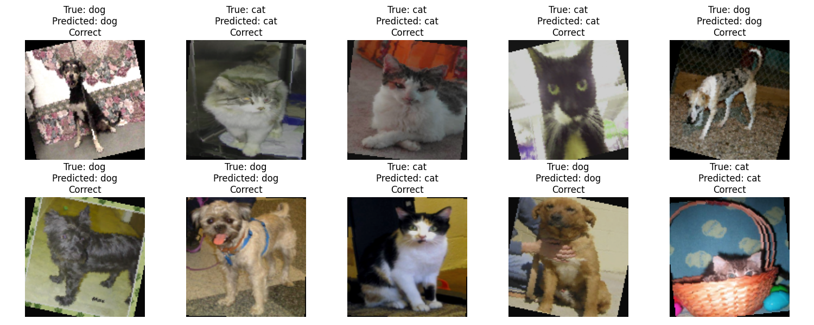
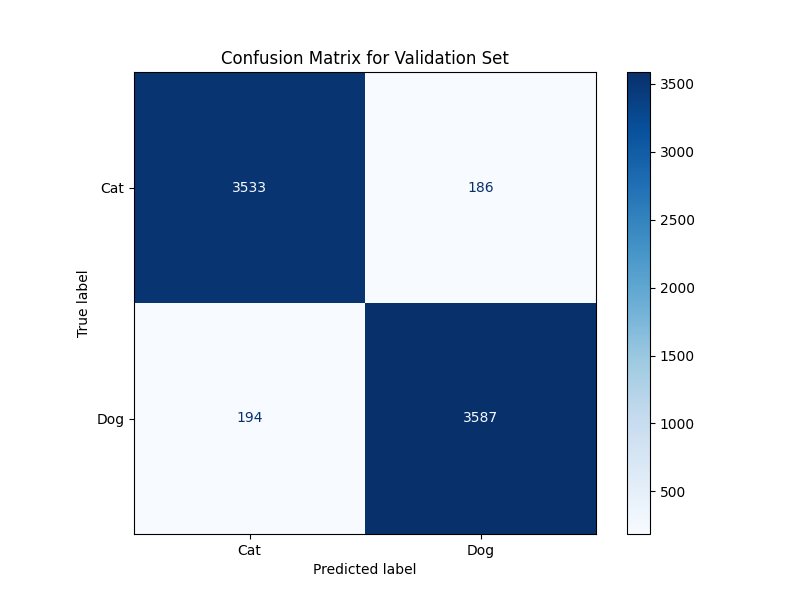
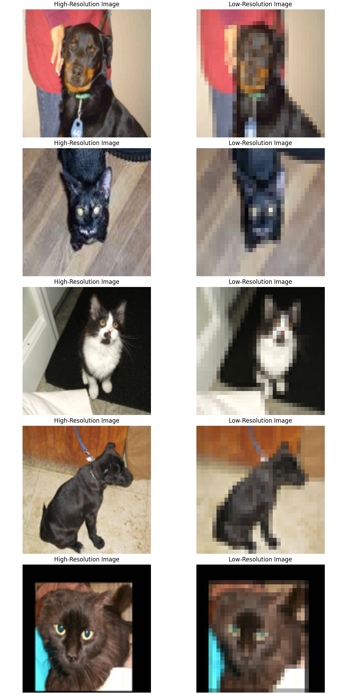
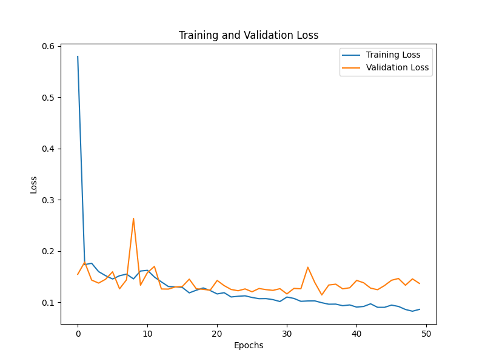
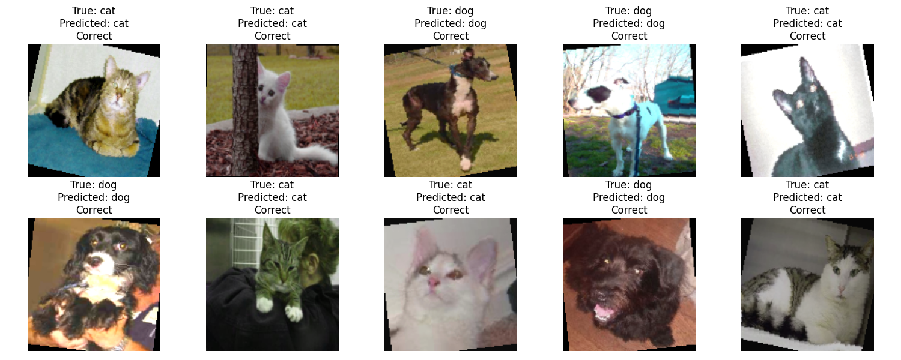
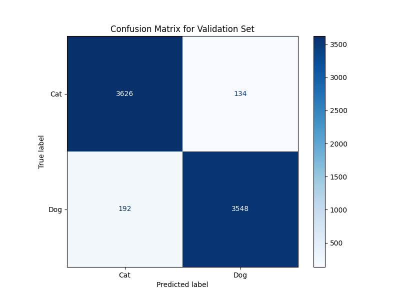

# Applied AI Midterm Exam: Super Resolution GAN (SRGAN) Implementation

**Model Files Folder(Models): The trained models for this project are available [here](https://drive.google.com/drive/folders/1jSthFVqBBslAtewAPHvz8z-jzTJB1PLl?usp=sharing).**

This project is part of the Midterm Exam for Applied AI. It aims to implement a Super Resolution Generative Adversarial Network (SRGAN) to enhance low-resolution images and subsequently use them in a binary classification problem for cat and dog images. The final model's performance is compared with a baseline model.

## Introduction: Super Resolution GAN (SRGAN)

Super Resolution GAN (SRGAN) is a deep learning architecture that combines GANs and Convolutional Neural Networks (CNNs) to generate high-resolution images from low-resolution inputs. The SRGAN architecture consists of a generator that attempts to produce high-resolution images and a discriminator that tries to distinguish between real and generated high-resolution images. The training process involves using the feedback from the discriminator to iteratively improve the generator's ability to produce realistic high-resolution outputs.

SRGAN has applications in medical imaging, satellite imagery, video processing, and other areas where enhancing low-resolution images is beneficial for analysis and decision-making.

## Steps Overview

The project followed these major steps:

1. **Binary Classification Model A using Transfer Learning**: The dataset was downscaled to 128x128, and a binary classifier (Model A) was trained on it using VGG16.
2. **Training SRGAN**: A SRGAN model was trained to upscale 32x32 images to 128x128 high-resolution images.
3. **Training Binary Classification Model B using Generated Images**: The images generated by SRGAN were used to train another classifier (Model B).
4. **Comparison of Models A and B**: Both models were compared using various metrics such as Accuracy, F1 Score, and AUC.

## Data Preparation

- The dataset was split into **70% training** and **30% validation**.
- Images were downscaled to **128x128** for classification purposes and further to **32x32** for SRGAN training.
- **Image augmentations** such as horizontal flipping, rotation, and color jittering were applied to improve model generalization.

## Training Model A: Binary Classifier

Model A was trained on the downscaled 128x128 images. The architecture used is a pre-trained **VGG16** model with the last layer modified to classify between cats and dogs.

- **Transformations Applied**: Resize to 128x128, random horizontal flip, rotation within 15 degrees, color jitter, and normalization.
- **Training and Validation Loss**:


- **Validation Metrics**: 


- **Validation Predictions**: 



- **Confusion Matrix**: 



## SRGAN Training

The SRGAN model was trained for **150 epochs** to upscale low-resolution (32x32) images to high-resolution (128x128) images.

- **Low-Resolution vs High-Resolution Examples**: 

  - These images showcase the difference between the original high-resolution images and their downscaled versions used for SRGAN training. The downscaled images are clearly lower in quality, with significant loss of details, whereas the high-resolution images retain much more texture and clarity. This contrast emphasizes the importance of super-resolution techniques in restoring visual quality for better analysis.

- **Validation Sample Results**: 

  - The validation samples demonstrate the effectiveness of SRGAN in restoring the high-resolution features of the images. The super-resolved output closely resembles the ground truth high-resolution images, preserving crucial details such as fur texture, facial features, and overall sharpness. The comparison between low-resolution inputs, SRGAN-generated outputs, and high-resolution ground truths highlights how SRGAN improves visual quality significantly, making it valuable for subsequent tasks like classification.

- **Generator and Discriminator Loss Plot**: 

  - The generator and discriminator loss curves during training show a steady decrease in both losses, indicating successful adversarial training. The discriminator loss was scaled by 100 to better visualize its trend alongside the generator loss. The reason for scaling the discriminator loss is due to its typically smaller magnitude compared to the generator loss, which would make it difficult to visualize both losses on the same plot without scaling.
  - The discriminator loss (D_loss) stabilized around 0.5, which is a desired outcome in GAN training, indicating that the discriminator is effectively unable to distinguish between real and generated images half of the time. This balance is crucial for the adversarial training process, as it ensures that neither the generator nor the discriminator is overpowering the other.
  - The occasional spikes in discriminator loss are indicative of moments where the generator significantly improved, forcing the discriminator to adapt. Despite these fluctuations, the model returned to a stable region, demonstrating resilience and the ability to recover effectively. For example, between epochs 133 to 134, there was a noticeable spike in discriminator loss, but it quickly returned to a stable state, highlighting the dynamic balance between generator and discriminator during training.
  - Additionally, the generator loss (G_loss) showed a consistent decreasing trend, which signifies that the generator is learning to create more realistic high-resolution images as training progresses. The generator loss consists of multiple components, including **content loss**, **adversarial loss**, **perceptual loss**, and **total variation (TV) loss**. The adversarial loss reached a value close to 1.0, showing the generator's success in "fooling" the discriminator, while the perceptual loss and TV loss contributed to refining image quality and reducing artifacts.

    - **Example Training Output**:
    ```bash
        [148/150] Loss_D: 0.5006 Loss_G: 0.0060 Content: 0.0025 Adv: 0.9999 Perc: 0.4156 TV: 0.0080 D(x): 0.7999 D(G(z)): 0.0001: 100%|██████████| 274/274 [02:08<00:00,  2.12it/s]
        [149/150] Loss_D: 0.5006 Loss_G: 0.0060 Content: 0.0025 Adv: 0.9999 Perc: 0.4142 TV: 0.0080 D(x): 0.8000 D(G(z)): 0.0001: 100%|██████████| 274/274 [02:08<00:00,  2.13it/s]
        [150/150] Loss_D: 0.5006 Loss_G: 0.0060 Content: 0.0025 Adv: 0.9999 Perc: 0.4142 TV: 0.0080 D(x): 0.7999 D(G(z)): 0.0001: 100%|██████████| 274/274 [02:09<00:00,  2.12it/s]
    ```

## Training Model B: Using Generated Images

Model B was trained using the high-resolution images generated by SRGAN. These images, along with original training images, were used to create a larger dataset for training.

- **Transformations Applied**: Similar transformations were applied as in Model A.
- **Training and Validation Loss**:



- **Validation Metrics**: 


- **Validation Predictions**:



- **Confusion Matrix**: 



## Model Comparison

The performance of both models, A and B, was compared on the validation dataset:

### Metrics for Model A
- **Validation Loss**: 0.2068
- **Accuracy**: 95.27%
- **F1 Score**: 95.27%
- **AUC**: 95.27%

### Metrics for Model B
- **Validation Loss**: 0.1361
- **Accuracy**: 95.68%
- **F1 Score**: 95.68%
- **AUC**: 95.68%

### Observations
- Model B, which was trained using SRGAN-generated high-resolution images, showed slightly better performance compared to Model A. The validation loss for Model B was significantly lower (0.1361 compared to 0.2068 for Model A), indicating that the model was able to generalize better on the validation data.
- The validation accuracy, F1 score, and AUC for Model B were all higher than those for Model A, though the difference was not substantial (95.68% vs. 95.27%). This improvement demonstrates the positive effect of using SRGAN to enhance image quality, which ultimately helped the classifier to make more accurate predictions.
- From the training and validation loss curves, it can be observed that the model B had a decreasing trend in training loss, which indicates proper convergence. However, Model A's validation loss started to increase slightly, suggesting some overfitting, whereas Model B maintained a more stable validation loss, which is indicative of better generalization.
- The confusion matrices for the two models also provide insights into their performance. Model B made fewer incorrect predictions overall, with a reduction in misclassified images for both classes. Specifically, the number of incorrect predictions for cats decreased by 2, and for dogs, it decreased by 52 when using Model B compared to Model A. This suggests that the addition of SRGAN-generated images improved the classifier's ability to correctly identify both classes, particularly for the dog category.
- The validation metrics, including accuracy, F1 score, and AUC, were closely aligned between the two models, but Model B consistently outperformed Model A. This indicates that while the improvements may not be drastic, they are consistent across different evaluation metrics, further emphasizing the utility of SRGAN-generated images in improving model performance.

## Conclusion

The SRGAN-generated images improved the binary classification performance. This demonstrates the potential of using GAN-generated high-resolution images to enhance model training, especially in cases where high-quality images are not readily available. The consistent improvement across different metrics—accuracy, F1 score, AUC, and the confusion matrix—supports the conclusion that the use of SRGAN can effectively enhance classification tasks.

The complete implementation and results can be reproduced using the provided code and documentation. The training scripts, validation scripts, and all required configuration files are available in this repository.

