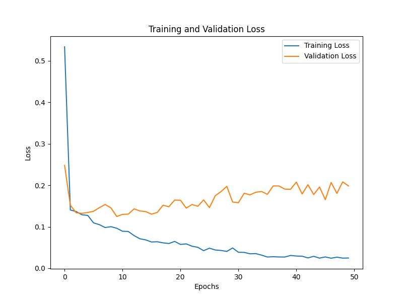

# Applied AI Midterm Exam - README

## Introduction
This project is part of the Applied AI midterm exam, focusing on building a Super Resolution Generative Adversarial Network (SRGAN) for image enhancement and using it for binary classification. The first part of the project involves training a binary classifier (Model A) using transfer learning, while the later stages will focus on implementing the SRGAN and a second classifier (Model B) trained on the enhanced images.

**Super Resolution GAN (SRGAN)** is a deep learning architecture that enhances the resolution of images. It uses both a generator network, which creates high-resolution images from low-resolution inputs, and a discriminator network, which tries to distinguish between real and generated images. SRGAN has practical applications in fields such as medical imaging, satellite imagery, and video processing.

The goal of this midterm project is to use SRGAN to generate high-resolution images and use them to improve the performance of a binary classification model, comparing it with the original classifier.

## Project Steps

### 1. Train a Binary Classifier (Model A)
- **Dataset Preparation**: We used a dataset containing images of cats and dogs. The dataset was divided into 70% training and 30% testing.
- **Image Preprocessing**: Images were downscaled to 128x128 resolution, with several transformations applied:
  - **Resizing**: Images resized to 128x128.
  - **Data Augmentation**: Random horizontal flip, random rotation, and color jitter were applied to increase the robustness of the model.
  - **Normalization**: Images were normalized with a mean and standard deviation of 0.5.

- **Model Architecture**: A pre-trained VGG16 model was used as the base model, with the classifier modified to output two classes: cat and dog.
- **Training**: The model was trained using the following setup:
  - **Loss Function**: CrossEntropyLoss.
  - **Optimizer**: Adam optimizer with a learning rate of 0.001.
  - **Epochs**: The model was trained for 20 epochs, with checkpointing to save progress.

- **Metrics**: The model was evaluated on validation data using several metrics:
  - **Accuracy**: 96.33%
  - **F1 Score**: 0.9633
  - **AUC**: 0.9632

- **Results**:
  - Training and validation loss curves were plotted, showing convergence over time.
  - Validation metrics (accuracy, F1 score, and AUC) were also plotted to visualize model performance.
  - A confusion matrix was generated to show classification performance for both classes.
  - Incorrect predictions were analyzed to understand the weaknesses of the model.

#### Analysis of Results
- The classifier achieved high accuracy, F1 score, and AUC, indicating good overall performance.
- The training and validation loss curves showed that the model converged well, with minimal overfitting.
- The confusion matrix revealed that most misclassifications occurred between similar-looking cat and dog images, suggesting that the model struggled with certain ambiguous cases.
- Analyzing incorrect predictions highlighted that some images had poor quality or contained multiple objects, which may have contributed to incorrect classifications.

### 2. Demonstrate Image Transformations
- **Transformed Samples**: Samples from the training set were displayed to verify the augmentation and normalization steps. The original images, transformed images (augmented), and normalized images were visualized to confirm the preprocessing steps.

### 3. SRGAN Implementation (To Be Completed)
The next step of the project will involve training an SRGAN to generate high-resolution images from low-resolution inputs. Specifically:
- **Train the SRGAN**: The SRGAN will be trained to enhance images from 32x32 to 128x128 resolution.
- **Integration with Model B**: The high-resolution images generated by SRGAN will be used to train a new binary classifier (Model B).
- **Comparison**: The performance of Model A and Model B will be compared using metrics such as accuracy, F1 score, and AUC.

## Visualizations
The following visualizations were generated during the project:

1. **Training and Validation Loss:**

   

2. **Validation Metrics:**

   

3. **Confusion Matrix:**

   

4. **Sample Image Transformations:**

   

5. **Incorrect Predictions:**

   

6. **Validation Sample Predictions:**

   

## Instructions to Reproduce
To reproduce the current results, follow these steps:

1. **Install Dependencies**:
   - Python 3.8 or higher
   - PyTorch
   - Torchvision
   - Scikit-learn
   - Matplotlib
   - tqdm
   - PIL (Pillow)

   You can install the necessary packages using the following command:
   ```bash
   pip install torch torchvision scikit-learn matplotlib tqdm pillow
   ```

2. **Prepare the Dataset**:
   - Place the dataset in a directory called `dataset/train`.
   - Ensure that images are named appropriately to indicate their classes (e.g., `cat.0.jpg`, `dog.0.jpg`).

3. **Run the Training Script**:
   - Use the provided Python script to train the binary classifier.
   - Make sure to adjust the dataset path if necessary.

4. **Visualize Results**:
   - The script will generate several visualizations, including loss curves, metrics plots, a confusion matrix, and incorrect predictions.
   - These visualizations are saved in the `figures` directory.

## Future Work
- Implement SRGAN training to generate high-resolution images from low-resolution inputs.
- Train Model B using the SRGAN-generated images and compare its performance to Model A.
- Train SRGAN for at least 150 epochs to achieve high-quality image generation.

## Notes
- Due to limited time available on Google Colab for GPU usage, the models are saved after each epoch. This allows for resuming training when GPU time is available again.

## Conclusion
Currently, the binary classifier (Model A) has achieved good performance with an accuracy of 96.33%, and further improvements are expected by incorporating SRGAN-generated high-resolution images for Model B. The SRGAN implementation and training will be the focus of the next steps in the project.
